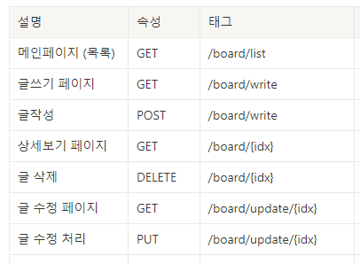
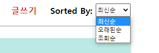
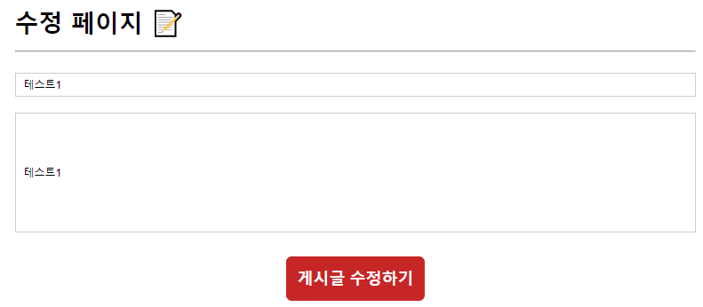

# SpringBoot & React & JPA 로 게시판 구현하기

프로젝트 기간 팀원 소개

기간 : 2022 01월 19일 ~ 2022년 01월 27일

👨🏻‍🤝‍👨🏻 Front: 조승원 & 원용재

👨🏻‍🤝‍👨🏻 Back: 윤소영 & 신윤상

---

:dart: 개발목표

1. 서로 다른 개발환경에서의 연동(CORS)
2. 게시글 조회, 등록, 상세보기, 수정, 삭제하기
3. 게시글 상세보기시 조회수 증가

---

백엔드 사용 기술

    • IDE : IntelliJ 2021.01
    • 개발 언어 : Java 11
    • 프레임워크 : SpringBoot 2.6.2
    • 영속성 프레임워크 : JPA
    • 빌드도구 : Gradle
    • 데이터베이스 : MySQL 8.0.23, AWS RDS 사용

프론트엔드 사용 기술
```aidl
무슨 무슨 기술
```

---

✔ API 설계



---

Backend Side

✔ 데이터베이스 설계


---

1. 게시판 목록 보기


2. 목록 정렬하기




3. 상세 페이지 (상세페이지를 누를시 조회수가 증가합니다.)


4. 수정 페이지



5. 삭제

   삭제를 누를시 바로 목록화면으로 넘어가고 게시글이 삭제된 채로 새로고침 됩니다.


